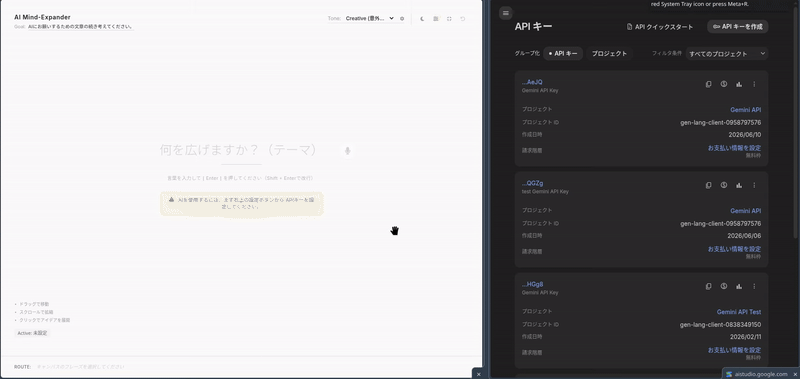

# AI Mind Expander

[](demo.gif)

AI Mind Expander は、AI (OpenAI / Google Gemini) の力を借りて、無限のキャンバス上でアイデアを視覚的に拡張・深掘りしていくためのブレインストーミングツールです。

## ✨ 特徴 (Features)
- **無限キャンバス**: マウスやタッチ操作で自由にズーム・パンニングが可能。思考の広がりに制限はありません。
- **AIによる自動拡張**: ノードをクリックするだけで、AIがこれまでの文脈を読み取り、新しいアイデアや派生ワードを自動生成して繋げます。
- **2つの主要AIモデルに対応**: OpenAI と Google Gemini の両方に対応。お好みのAPIキーを設定して使用できます。
- **トーン＆目的（Goal）の設定**: アイデア出しの「目的」や「AIの思考パターン/トーン（クリエイティブ、ロジカル、批判的など）」を自由にカスタマイズ可能。
- **ストーリー生成**: 繋がったノード（思考のパス）を選択し、それらのキーワードを元にした文章や物語をAIに一括生成させることができます。
- **シングルファイルアーキテクチャ**: ビルドや面倒な環境構築は不要。`index.html` をブラウザで開くだけですぐに動作します。
- **ダークモード対応**: システムのテーマに合わせたダークモードとライトモードを備えています。

## 📦 インストール方法 (Installation)

このツールはシングルファイルで構築されているため、面倒な環境構築（Node.jsやnpmなど）は一切不要です。以下の手順ですぐに使い始めることができます。

```bash
# 1. リポジトリをクローン
git clone https://github.com/yourusername/ai_mind_expander.git

# 2. フォルダに移動
cd ai_mind_expander
```

その後、フォルダ内にある `index.html` をお使いのブラウザ（Chrome, Edge, Safari推奨）にドラッグ＆ドロップするか、ダブルクリックして開いてください。

## 🚀 使い方 (How to Use)

### 1. APIキーの設定
ブラウザで開いたら、まずは画面左上の**歯車アイコン（設定）**をクリックします。
お好みのAI（OpenAI または Google Gemini）を選び、ご自身のAPIキーを入力して保存してください。
*※APIキーはブラウザのローカルストレージにのみ保存され、外部に送信されることはありません。*

### 2. ブレストの開始
画面中央の入力欄に、思考の起点となる最初のキーワード（例：「AIの未来」「休日の過ごし方」など）を入力し、Enterキーを押します。

### 3. アイデアの拡張
生成されたノードをクリックすると、AIがこれまでの文脈を読み取り、新しいアイデアや派生ワードを放射状に自動生成します。キャンバスはドラッグで移動、スクロールでズームが可能です。

### 4. 目的（Goal）とトーン（Tone）の変更
- **Goal:** 画面左上のGoalテキストをクリックすると、アイデア出しの具体的な目的を編集できます。これを設定することでAIの出力精度が向上します。
- **Tone:** 左側のドロワーメニューから、AIの思考パターン（クリエイティブ、ロジカルなど）をいつでも変更できます。

## 🛠️ 技術スタック (Tech Stack)
- HTML5 / CSS3
- Vanilla JavaScript
- [Tailwind CSS](https://tailwindcss.com/) (CDN)
- [Lucide Icons](https://lucide.dev/) (CDN)

## 🔒 セキュリティ
- 入力されたAPIキーは `localStorage` を使用してデバイスのブラウザ内にのみ保存され、開発者や第三者のサーバーには送信されません。
- XSS（クロスサイトスクリプティング）対策として、AIの生成テキストやユーザーの入力値はエスケープ処理された上で安全にレンダリングされます。

## 📄 ライセンス (License)
MIT License
